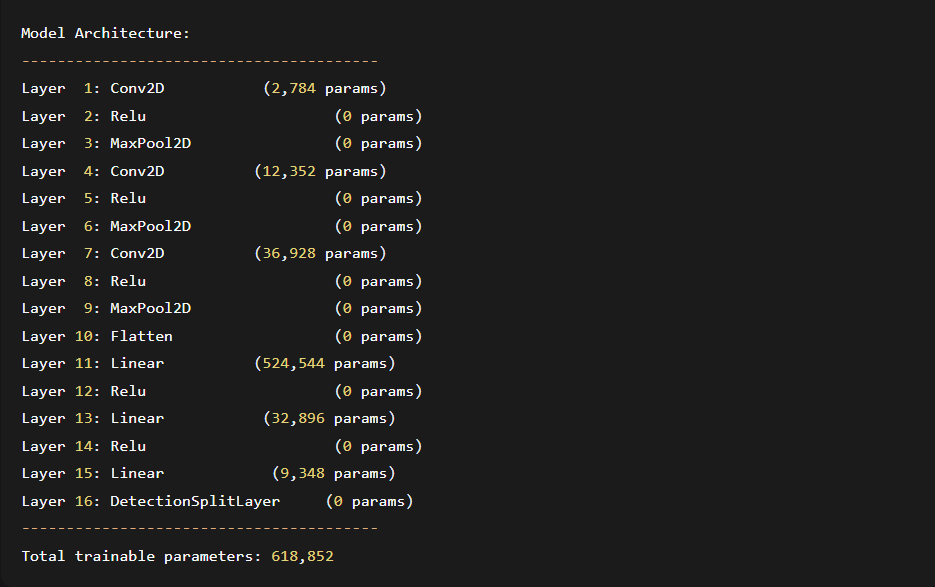
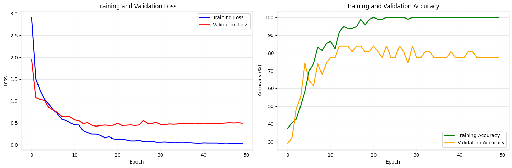
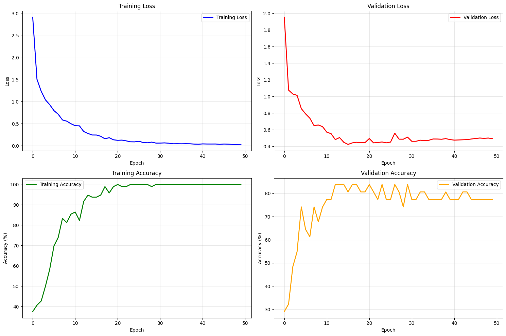
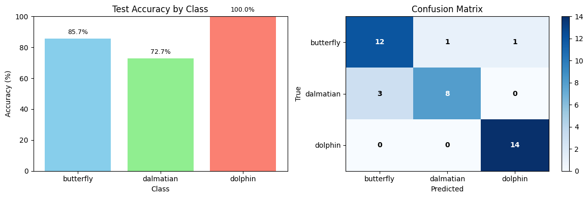

# 🧠 CNN Object Detection from Scratch (NumPy)

This project implements a **Convolutional Neural Network (CNN) from scratch using NumPy** for **image classification and single-object detection**.  
No deep learning frameworks (TensorFlow / PyTorch) are used — all forward and backward passes, optimizers, and layers are manually implemented.

---

## 📌 Features

- ✅ Custom CNN built **entirely with NumPy**
- ✅ Manual implementation of:
  - Convolutional layers
  - Max pooling
  - ReLU / LeakyReLU
  - Fully connected layers
  - Dropout
  - Softmax
- ✅ **Object detection** (classification + bounding box regression)
- ✅ Combined loss:
  - Cross-Entropy (classification)
  - Mean Squared Error (bounding boxes)
- ✅ Optimizers:
  - Adam
  - SGD
- ✅ Training progress bars with `tqdm`
- ✅ Visualization of predictions with bounding boxes

---

## 🖼️ Dataset

- **Classes**:
  - Butterfly 🦋
  - Dalmatian 🐕
  - Dolphin 🐬
- Images are resized to **64 × 64**
- Single object per image
- Dataset directory structure:
dataset/
├── butterfly/
├── dalmatian/
└── dolphin/

---

## 🏗️ Model Architecture

Input (3 × 64 × 64)
↓
Conv2D (16 filters) → LeakyReLU → MaxPool
↓
Conv2D (32 filters) → LeakyReLU → MaxPool
↓
Conv2D (64 filters) → LeakyReLU → MaxPool
↓
Flatten
↓
Linear (256) → LeakyReLU → Dropout
↓
Linear (128) → LeakyReLU → Dropout
↓
Linear (NUM_CLASSES + 4)
↓
DetectionSplitLayer


- **Output**:
  - Class probabilities
  - Bounding box coordinates `(x, y, w, h)`



---

## 📉 Loss Function

**DetectionLoss**  
A combination of:
- **Cross-Entropy Loss** for classification
- **Mean Squared Error (MSE)** for bounding box regression

Total Loss = CE + α × MSE


---

## 🚀 Training Configuration

- Epochs: `50`
- Batch size: `32`
- Optimizer: `Adam`
- Learning rate: `0.001`
- Train / Validation split: `80 / 20`

---

## 📊 Evaluation

- Accuracy is computed using **classification predictions**
- Bounding boxes are visualized on test images
- Training & validation loss/accuracy plots included

---

<p align="center">
  
  
  
  
</p>

## 🧪 How to Run

1. Install dependencies:
   ```bash
   pip install numpy tqdm matplotlib

2. Set dataset path in the script:

    dataset_root = "path/to/dataset"

You can reload weights before evaluation:

    model.load_weights("model_weights_with_adam.npz")


